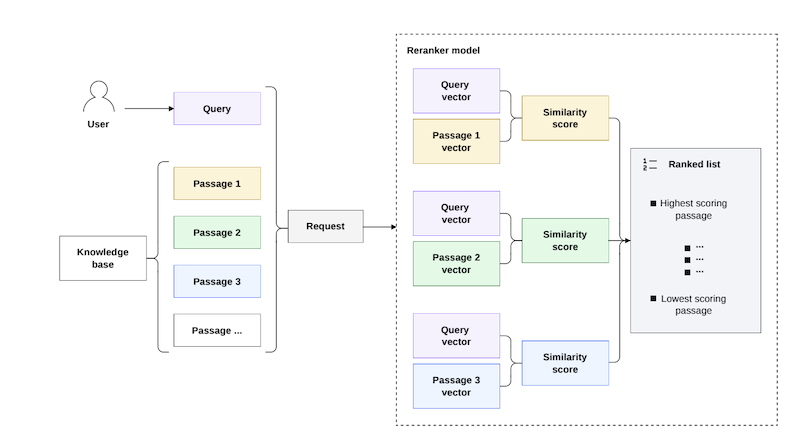
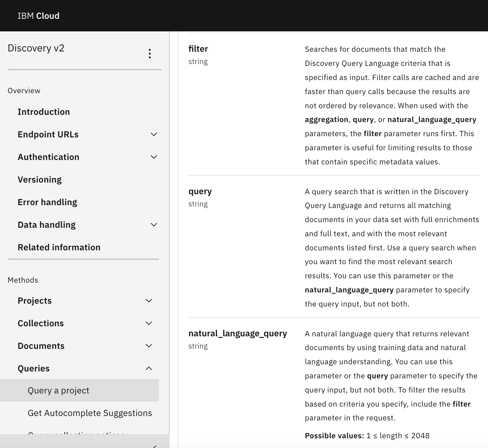
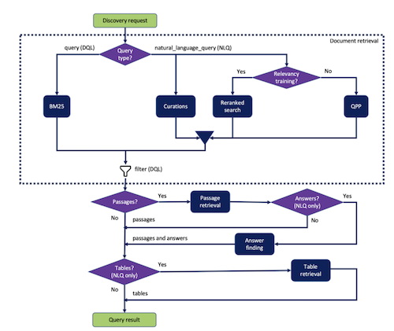

# Developer help

IBM watsonx.ai provides REST API reference documentation that conforms to the OpenAPI specification, which doesn't allow for comparisons or deeper explanations.

I added guidance to the product help that augments the API reference information. Here are a few of the topics I added which have graphics that help to explain how the methods work:

- [Time series forecasting](https://michelle-miller.github.io/samples/wx-time-series-api-sample.pdf){:target="_blank"}

  

- [Reranking document passages](https://michelle-miller.github.io/samples/wx-rerank-api-sample.pdf){:target="_blank"}

  

[Start of page](https://michelle-miller.github.io/developer-help.html){: .amini}

## Watson Discovery API reference

I created the following API reference from a JSON file that conforms to the OpenAPI specification:

- [Discovery API reference](https://cloud.ibm.com/apidocs/discovery-data){:target="_blank"}

  

Different processing steps are available depending on the query method you use. I added supplemental guidance to the product documentatation to help developers understand their options and make the right choice.

- [IBM Watson Discovery: Query overview](https://michelle-miller.github.io/samples/discovery-data-query-api-sample.pdf){:target="_blank"}

  

[Start of page](https://michelle-miller.github.io/developer-help.html){: .amini}

## Watson Assistant developer content

These Spring Expression Language (SpEL) descriptions and examples help chatbot builders implement more advanced logic in their IBM Watson Assistant dialog flows:

- [Expression language methods](https://michelle-miller.github.io/samples/assistant-spel-sample.pdf){:target="_blank"}

[<- Back to home page](https://michelle-miller.github.io){: .amini}