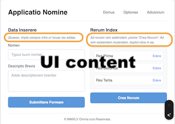

# Writing samples

As a lead technical writer for IBM Data and AI and IBM Cloud software services, I created content that helps customers to complete tasks, such as:

- Using foundation models to improve day-to-day business operations with generative AI. See [IBM watsonx.ai](https://www.ibm.com/docs/SSYOK8/wsj/analyze-data/fm-overview.html){:target="_blank"}.
- Analyzing and visualizing enterprise data. See [IBM Watson Discovery](https://michelle-miller.github.io/samples/discovery-data-sample.pdf){:target="_blank"}.
- Building AI chatbots. See [IBM Watson Assistant](https://michelle-miller.github.io/samples/assistant-sample.pdf){:target="_blank"}.

Find samples of help content for software users with various roles and experience levels.

| | |
|-|-|
|   | |
|  |  |
{: .tableimg}

Note: These images were created with the Google Gemini AI image generator.

## Links to samples

- [UI content](ui-content.html)
- [User help](user-help.html)
- [Developer help](developer-help.html)
- [Administrator help](administrator-help.html)

[Start of page](https://michelle-miller.github.io/){: .amini}
