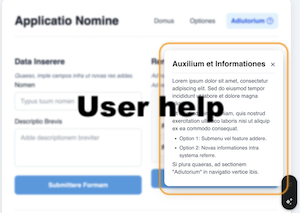
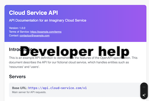

# Software technical documentation

As a lead technical writer for IBM Data and AI and IBM Cloud software services, I created content that helps customers complete goals, such as:

- Using foundation models to improve day-to-day business operations with generative AI. See [IBM watsonx.ai](https://www.ibm.com/docs/SSYOK8/wsj/analyze-data/fm-overview.html){:target="_blank"}.
- Analyzing and visualizing enterprise data. See [IBM Watson Discovery](https://michelle-miller.github.io/samples/discovery-data-sample.pdf){:target="_blank"}.
- Building AI chatbots. See [IBM Watson Assistant](https://michelle-miller.github.io/samples/assistant-sample.pdf){:target="_blank"}.

Find samples of help content for software users with various roles and experience levels.

[UI content](#user-interface-content){: .btn} [User help](#user-help){: .btn} [Developer help](#developer-help){: .btnwide} [Administrator help](#developer-help){: .btnwide} 

| | |
|-|-|
| UI content  | User help |
| Developer help  | Administrator help  |

## User interface content

The key to effective UI content is to anticipate user needs and add useful information in simple language as close to the user's current task as possible. 

The following examples illustrate my ability to craft helpful UI content:

- [Tooltips](#tooltips)
- [Learn more links](#learn-more-links)
- [UI walkthroughs](#ui-walkthroughs)
- [Content design reviews](#content-design-reviews)
- [Videos](#videos)

### Tooltips

Keep helpful information in reach whenever possible.

### Learn more links

Implement a progressive disclosure model that lets users control when they get more information. 

The *Learn more* link shown in this screenshot opens the example topic that is listed in the first row of the [User help](#user-help) table.
 
### UI walkthroughs

Build walkthroughs that help users to get familiar with new tools.

### Content design reviews

Team with UI designers to craft UI language that supports the task workflow.

### Videos

Create short videos to explain complex concepts.

- Title: When and why to prompt tune a foundation model
- Duration: 3 minutes

<iframe width="50%" height="100%" src="https://video.ibm.com/embed/recorded/133282182" scrolling="no" allowfullscreen webkitallowfullscreen frameborder="0" style="border: 0 none transparent;"></iframe> 

[Start of page](https://michelle-miller.github.io/){: .amini}

## User help

The following table has links to content that was written by me and that illustrates various approaches for providing straight-forward, helpful information.

Note: Most of the examples are shared as point-in-time PDFs rather than links to online help pages that are now maintained by other writers.

| Writing approach | Examples |
|------------------|----------|
| Incorporate images and diagrams in conceptual information to illustrate concepts and explain processes. | - Explain how to adjust AI model behavior: [IBM watsonx.ai: Parameters for prompting foundation models](https://michelle-miller.github.io/samples/wx-llm-parameters-sample.pdf){:target="_blank"}  - Help low-code users implement a simple retrieval-augmented generation (RAG) pattern: [IBM watsonx.ai: Chatting about documents and images](https://michelle-miller.github.io/samples/wx-chatting-sample.pdf){:target="_blank"} |
| Focus on user goals, not product features. | The following two samples show content for a tool called Content Miner in IBM Watson Discovery before and after I revised the information to be task-based:  [Before](https://michelle-miller.github.io/samples/contentmine-before.pdf){:target="_blank"} & [After](https://michelle-miller.github.io/samples/contentmine-after.pdf){:target="_blank"} |
| Describe and compare available options to help customers make good choices. | [IBM watsonx.ai: Methods for tuning foundation models](https://michelle-miller.github.io/samples/wx-tuning.pdf){:target="_blank"} |
| Single-source user content when possible to save time and resources. | The following online topic is single-sourced in Markdown and included in two different IBM watsonx.ai doc sets:  - SaaS docs: [When to tune a model](https://www.ibm.com/docs/SSYOK8/wsj/analyze-data/fm-tuning-when.html){:target="_blank"}  - On-premises docs: [When to tune a model](https://www.ibm.com/docs/SSLSRPV_2.1.x/wsj/analyze-data/fm-tuning-when.html){:target="_blank"} |
| Give users more than one way to digest information. | In this topic, which is sourced in Markdown, the same information is covered both in the table and in the paragraphs that follow the table: [IBM watsonx.ai: Security and privacy for foundation models](https://michelle-miller.github.io/samples/wx-security.html){:target="_blank"} |
| Write content that can be consumed by LLMs as part of a retrieval-augmented generation (RAG) pattern to return factual answers. | I optimized the documentation for retrieval by the IBM watsonx.ai LLM-based search app and regularly reviewed search results and user feedback to improve how the help content performs. **Try it out**: In the [Find information](https://dataplatform.cloud.ibm.com/docs/content/wsj/getting-started/welcome-main.html?context=wx){:target="_blank"} field, add a question and then click the bee icon. |

[Start of page](https://michelle-miller.github.io/){: .amini}

## Developer help

I created the following guidance to augment the IBM watsonx.ai API reference documentation:

- [Time series forecasting](https://michelle-miller.github.io/samples/wx-time-series-api-sample.pdf){:target="_blank"}
- [Reranking document passages](https://michelle-miller.github.io/samples/wx-rerank-api-sample.pdf){:target="_blank"}

These Spring Expression Language (SpEL) descriptions and examples help chatbot builders implement more advanced logic in their IBM Watson Assistant dialog flows:

- [Expression language methods](https://michelle-miller.github.io/samples/assistant-spel-sample.pdf){:target="_blank"}

### API reference

I created the following API reference from a JSON file that conforms to the OpenAPI specification:

- [Discovery API reference](https://cloud.ibm.com/apidocs/discovery-data){:target="_blank"}

I added supplemental guidance to the product documentatation to help developers use the API effectively, such as [IBM Watson Discovery: Query overview](https://michelle-miller.github.io/samples/discovery-data-query-api-sample.pdf){:target="_blank"}.

## Administrator help

This content was written in DITA with Oxygen XML Author:  [Installing the IBM Watson Discovery service in IBM Cloud Pak for Data](https://michelle-miller.github.io/samples/CP-Data-4.7.x-Admin-Disco.pdf){:target="_blank"}

[Start of page](https://michelle-miller.github.io/){: .amini}
