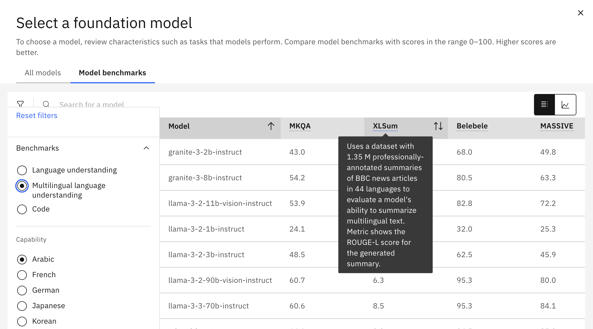
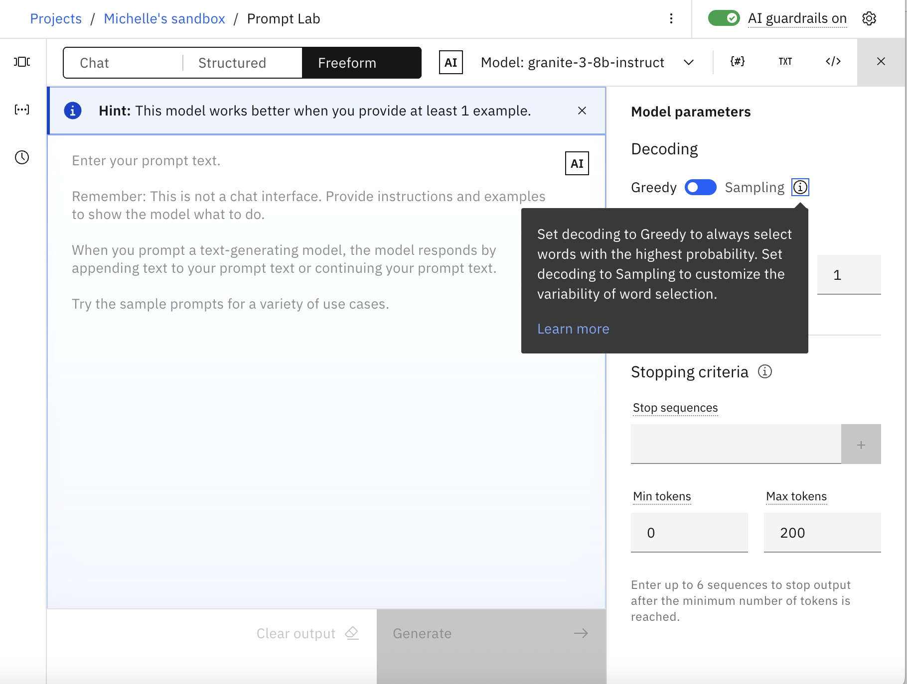
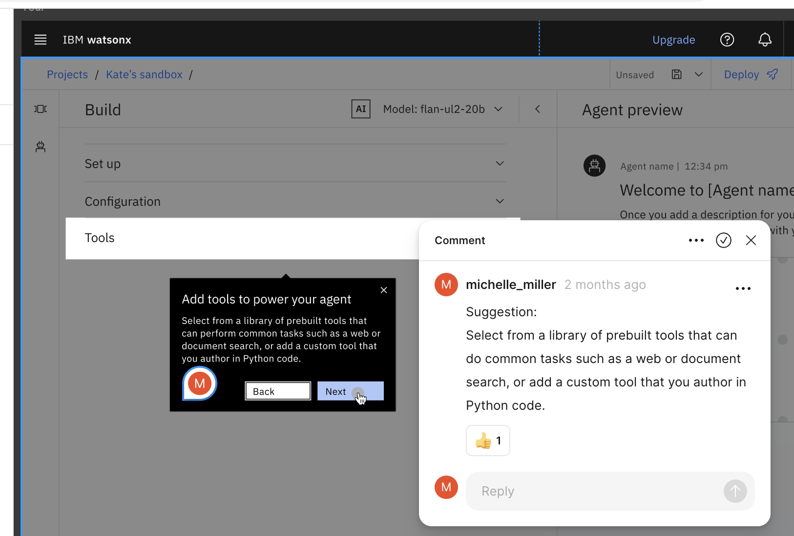
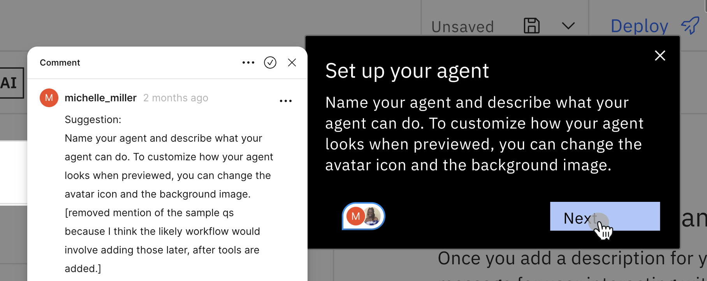

# User interface content

The key to effective UI content is to anticipate user needs and add useful information in simple language as close to the user's current task as possible. 

The following examples illustrate my ability to craft helpful UI content:

- [Tooltips](#tooltips)
- [Learn more links](#learn-more-links)
- [UI walkthroughs](#ui-walkthroughs)
- [Content design reviews](#content-design-reviews)
- [Videos](#videos)

[<- Back to home page](https://michelle-miller.github.io){: .amini}

## Tooltips

Keep helpful information in reach whenever possible.

## Learn more links

Implement a progressive disclosure model that lets users control when they get more information. 

The *Learn more* link shown in this screenshot opens the first user help example that is listed in [Show, don't tell](user-help.html#show-dont-tell).
 
## UI walkthroughs

Build walkthroughs that help users to get familiar with new tools.

## Content design reviews

Team with UI designers to craft UI language that supports the task workflow.

## Videos

Create short videos to explain complex concepts.

- Title: When and why to prompt tune a foundation model
- Duration: 3 minutes

<iframe width="50%" height="100%" src="https://video.ibm.com/embed/recorded/133282182" scrolling="no" allowfullscreen webkitallowfullscreen frameborder="0" style="border: 0 none transparent;"></iframe> 

[Start of page](https://michelle-miller.github.io/ui-content.html){: .amini}