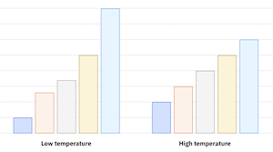
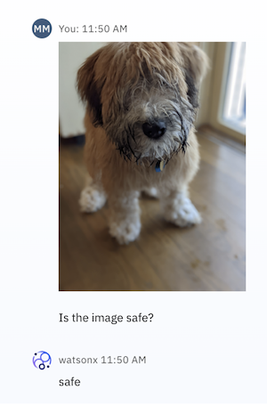
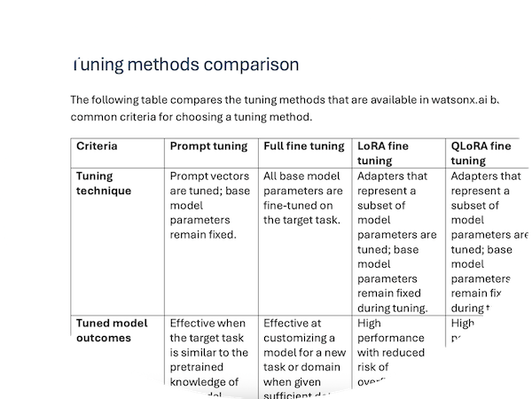

# User help

This page has links to content that was written by me and that illustrates various approaches for providing straight-forward, helpful information.

The approaches include:

- [Show, don't tell](#show-dont-tell)
- [Focus on user goals](#focus-on-user-goals-not-product-features)
- [Give decision-point advice](#give-decision-point-advice)
- [Write it once](#write-it-once)
- [Target diverse learning methods](#target-diverse-learning-methods)
- [Befriend AI](#befriend-ai)

Note: Most of the following examples are shared as point-in-time PDFs rather than links to online help pages that are now maintained by other writers.

[<- Back to home page](https://michelle-miller.github.io){: .amini}

## Show, don't tell

Incorporate images and diagrams in conceptual information to illustrate concepts and explain processes.

| | |
|:-|-|
| Explain how to adjust AI model behavior: [IBM watsonx.ai: Parameters for prompting foundation models](https://michelle-miller.github.io/samples/wx-llm-parameters-sample.pdf){:target="_blank"} |  |
| Help low-code users implement a simple retrieval-augmented generation (RAG) pattern: [IBM watsonx.ai: Chatting about documents and images](https://michelle-miller.github.io/samples/wx-chatting-sample.pdf){:target="_blank"} |  |

## Focus on user goals, not product features

The following table shows two samples of content for a tool called Content Miner in IBM Watson Discovery before and after I revised the information to be task-based:

<table style="width:70%">
<tr>
<th style="height: 25px"></th><th></th>
</tr>
<tr>
<td><a href="https://michelle-miller.github.io/samples/contentmine-before.pdf" target="_blank">Before</a></td>
<td><a href="https://michelle-miller.github.io/samples/contentmine-after.pdf" target="_blank">After</a></td>
</tr>
</table>

Here's a summary of my changes:

- Focused on user tasks and described options as they become relevant to the task rather than explaining the available modes and views out of context.
- Removed lists of UI options and descriptions. Relied instead on tooltips and inline help with links to more information in the help content.
- Added information that was previously missing about a key product differentiator, which is custom facets that you can create and then use to analyze your data.

[Start of page](https://michelle-miller.github.io/user-help.html){: .amini}

## Give decision-point advice

Describe and compare available options to help customers make good choices.

See [IBM watsonx.ai: Methods for tuning foundation models](https://michelle-miller.github.io/samples/wx-tuning.pdf){:target="_blank"}.

## Write it once

Single-source user content when possible to save time and resources. 

The following online topic is single-sourced in Markdown and included in two different IBM watsonx.ai doc sets:
 
| | |
|-|-|
| Software-as-a-service docs | [When to tune a model](https://www.ibm.com/docs/SSYOK8/wsj/analyze-data/fm-tuning-when.html){:target="_blank"} |
| On-premises docs| [When to tune a model](https://www.ibm.com/docs/SSLSRPV_2.1.x/wsj/analyze-data/fm-tuning-when.html){:target="_blank"} |

A few benefits of chunking and single-sourcing your content include:

- When content lives in one file rather than multiple files, it's easier to keep the information accurate and up-to-date.
- Search mechanisms, including LLM-driven apps, can more easily find and return the right content when it is restricted to one file.
- Single-sourcing doesn't prevent you from tailoring the content for different use cases. For example, you can use filtering to include or omit content for different outputs. In these examples topics, you might notice that different tuning methods are supported in the SaaS versus on-premises deployments.

[Start of page](https://michelle-miller.github.io/user-help.html){: .amini}

## Target diverse learning methods

Give users more than one way to digest information.

In this topic, the same information is covered both in the table and in the paragraphs that follow the table: [IBM watsonx.ai: Security and privacy for foundation models](https://michelle-miller.github.io/samples/wx-security.html){:target="_blank"} 

## Befriend AI

Write content that can be consumed by LLMs as part of a retrieval-augmented generation (RAG) pattern to return factual answers. 

I optimized the documentation for retrieval by the IBM watsonx.ai LLM-based search app and regularly reviewed search results and user feedback to improve the retrievability and succinctness of the help content.

[Start of page](https://michelle-miller.github.io/user-help.html){: .amini}
